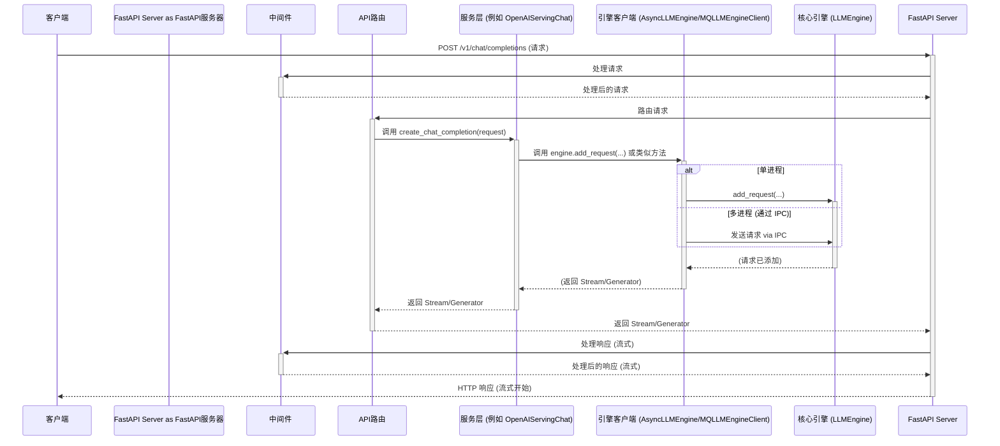
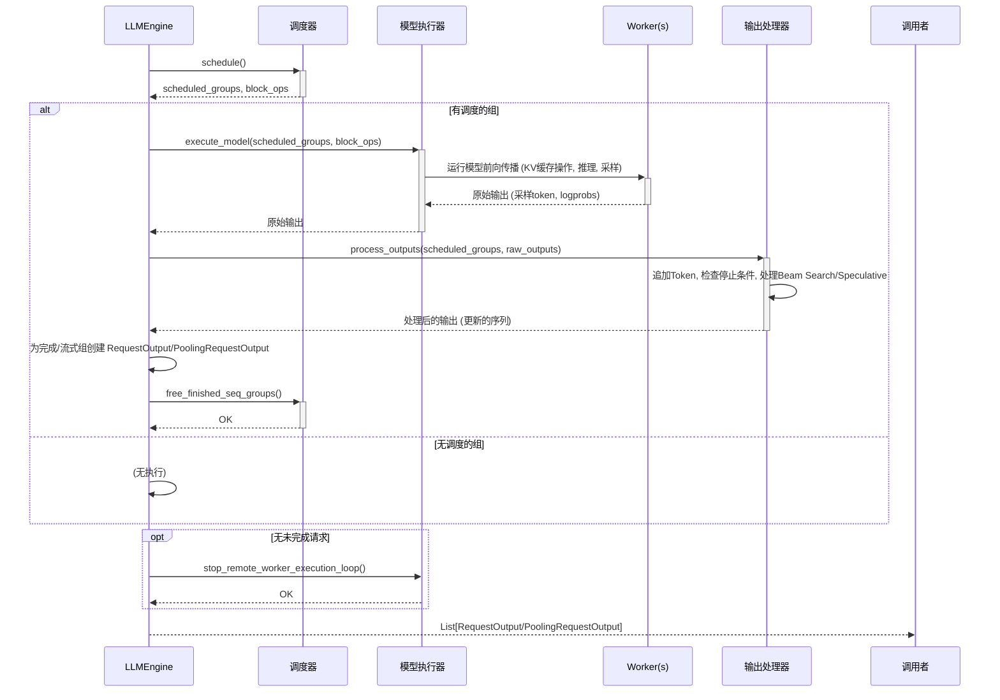

# vLLM OpenAI API 服务器请求处理流程分析

本文档基于 `vllm/entrypoints/openai/api_server.py` 和 `vllm/engine/llm_engine.py` 源代码，分析了 vLLM OpenAI 兼容 API 服务器从接收请求到返回响应的完整流程，并深入探讨了引擎内部的核心处理步骤。`wzh.evid` 目录为空，因此未包含特定的日志或错误信息。

## 核心组件

1.  **FastAPI 应用:** 作为基础，处理传入的 HTTP 请求、路由、中间件和响应生成。
2.  **API 路由 (`APIRouter`):** 定义具体的 API 端点，例如 `/v1/chat/completions`、`/v1/completions` 等。
3.  **服务类 (`OpenAIServing*`):** 例如 `OpenAIServingChat`、`OpenAIServingCompletion`、`OpenAIServingEmbedding` 等类，封装了处理特定 OpenAI API 格式的逻辑。它们负责将传入的请求转换为 vLLM 引擎可以理解的格式，并将引擎的输出格式化回 OpenAI 标准。
4.  **引擎客户端 (`EngineClient`):** 一个抽象层（单进程模式下为 `AsyncLLMEngine`，多进程模式下为 `MQLLMEngineClient`），用于与核心 vLLM 推理引擎通信。它发送处理请求（如生成文本或嵌入）并接收结果。
5.  **vLLM 核心引擎 (`LLMEngine`):** 底层引擎，负责管理 LLM 模型、KV 缓存、请求调度、分词、推理执行、采样和反分词等。

## 请求处理流程 (API Server -> Engine)

1.  **HTTP 请求到达:** 客户端向服务器发送 HTTP 请求（例如，POST 到 `/v1/chat/completions`）。
2.  **中间件处理:** FastAPI 中间件（CORS、认证、日志记录、自定义中间件）处理请求。
3.  **路由:** FastAPI 根据 URL 路径和 HTTP 方法将请求路由到相应的路径操作函数（例如，`/v1/chat/completions` 对应 `create_chat_completion` 函数）。
4.  **依赖注入与处理器获取:** FastAPI 解析依赖项。处理函数通常依赖于从应用程序状态 (`request.app.state`) 中获取正确的 `OpenAIServing*` 实例。
5.  **服务层处理:** 调用获取到的处理器的相应方法（例如 `handler.create_chat_completion`），并传入请求对象。此方法验证请求、将其转换为引擎参数，并调用 `EngineClient`。
6.  **引擎客户端交互:** `EngineClient` 接收来自服务层的请求。
    *   **单进程 (`AsyncLLMEngine`):** 直接调用 `LLMEngine` 的方法（如 `add_request`）。
    *   **多进程 (`MQLLMEngineClient`):** 通过 ZeroMQ IPC 将请求发送到独立的引擎进程。
7.  **进入引擎:** 请求被添加到 `LLMEngine` 的请求池中，等待处理。

### API Server -> Engine 时序图

## 引擎内部核心流程 (`LLMEngine.step()`)

`LLMEngine.step()` 方法是引擎的心跳，负责驱动整个推理过程。

1.  **调度阶段 (Scheduling):**
    *   引擎检查是否需要运行调度器 (`scheduler.schedule()`)。在多步解码或上一步有请求失败时可能跳过。
    *   调度器决定本次迭代运行哪些序列组 (`scheduled_seq_groups`)、它们的元数据 (`seq_group_metadata_list`) 以及 KV 缓存块操作 (`blocks_to_swap_in/out/copy`)。
    *   调度器基于策略（如 FCFS）、KV 缓存状态和序列组状态（等待、运行中、已换出）做出决策。

2.  **执行阶段 (Execution):**
    *   如果调度器确定有序列组要运行：
        *   构建 `ExecuteModelRequest`，包含调度信息和块操作。
        *   调用 `model_executor.execute_model()`，将请求分发给底层 Worker。
        *   Worker 执行核心计算：KV 缓存操作、模型前向传播、采样。
        *   `model_executor` 从 Worker 收集原始输出（采样得到的 token、logprobs 等）并返回给 `LLMEngine`。
    *   如果 Worker 处理输入时出错 (`InputProcessingError`)，引擎会中止该特定请求，并在下一步重试批次中的其余请求。

3.  **输出处理阶段 (Output Processing):**
    *   引擎调用 `_process_model_outputs()` 处理来自 `model_executor` 的原始输出。
    *   **更新序列状态:** 将新采样的 token 和 logprobs 追加到序列组中的每个序列。
    *   **检查停止条件:** 使用 `StopChecker` 检查是否达到 EOS、最大长度或停止字符串。
    *   **后处理:** 如果使用 Beam Search 或 Speculative Decoding，`SequenceGroupOutputProcessor` 会应用相应逻辑。
    *   **更新度量:** 记录时间戳等度量信息。
    *   **标记完成:** 设置已完成序列/序列组的状态。
    *   **生成请求输出:** 为已完成或正在流式传输中间结果的序列组创建 `RequestOutput` 或 `PoolingRequestOutput` 对象。**在这一步中，`RequestOutput.from_seq_group` 方法会调用序列 (`Sequence`) 对象的 `get_output_text_to_return()` 方法，该方法内部使用 `Detokenizer` 将 Worker 输出的 token ID 列表转换为人类可读的文本字符串。**

4.  **清理与返回:**
    *   在调度器中释放已完成的序列组占用的资源。
    *   如果引擎检测到没有未完成的请求，可能会停止 Worker 上的后台执行循环。
    *   返回本次迭代生成的 `RequestOutput`/`PoolingRequestOutput` 列表给调用者（如 `AsyncLLMEngine`）。

### 引擎内部 (`LLMEngine.step()`) 时序图

