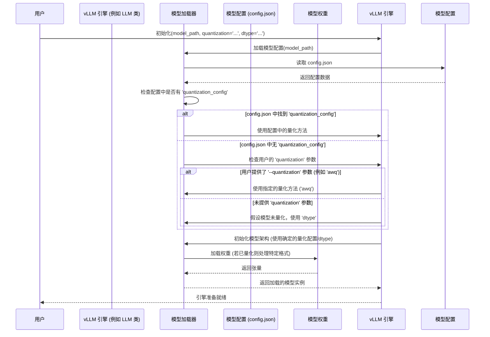
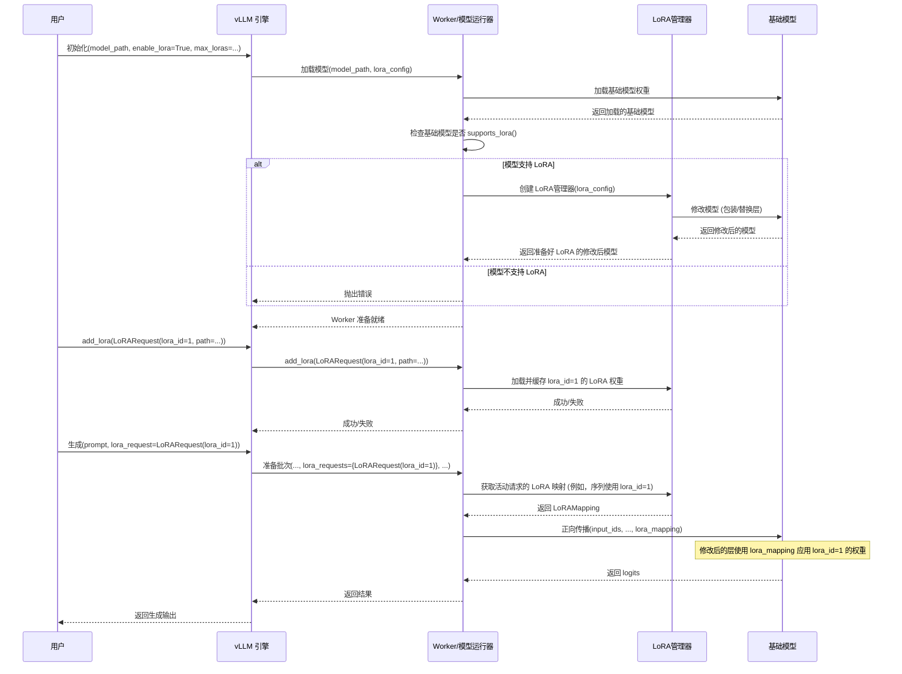

# vLLM 量化与 LoRA 处理机制分析

本文档总结了 vLLM 在处理模型量化 (Quantization) 和低秩适应 (LoRA, Low-Rank Adaptation) 方面的机制。

## 1. 量化 (Quantization)

### 1.1 是否支持对任意模型进行量化？

**不支持。** vLLM 通常不提供对任意全精度模型进行即时量化的功能。它依赖于特定的、预定义的量化方法，并期望模型在加载 *之前* 就已经使用这些受支持的技术进行了量化。

*   **支持的方法：** vLLM 明确支持 AWQ、GPTQ、FP8 (实验性)、BitsAndBytes 和 GGUF 等方法。量化方法的选择通常通过命令行参数 (`--quantization`) 指定，或者从模型的配置文件 (`config.json`) 中推断。
    ```python
    # vllm/engine/arg_utils.py
    parser.add_argument('--quantization',
                        '-q',
                        choices=[*QUANTIZATION_METHODS, None], # QUANTIZATION_METHODS 可能包含 'awq', 'gptq' 等
                        default=EngineArgs.quantization,
                        help='Method used to quantize the weights. If '
                        'None, we first check the `quantization_config` '
                        'attribute in the model config file. If that is '
                        'None, we assume the model weights are not '
                        'quantized and use `dtype` to determine the data '
                        'type of the weights.')
    ```
*   **预量化要求：** 通常需要使用外部工具（如 AutoAWQ, AutoGPTQ）先对模型进行量化，并将其保存为 vLLM 可理解的格式。GGUF 格式的模型本身就包含了量化信息。
*   **特定集成：** 可能存在特定硬件的例外情况，例如与 Intel Neural Compressor (INC) 的集成，用于 Habana 处理单元 (HPU)，这似乎涉及在 vLLM worker 内部执行准备步骤。但这并非通用功能。
    ```python
    # vllm/worker/hpu_model_runner.py
    if self.model_config.quantization == 'inc':
        logger.info("Preparing model with INC..")
        # ... 量化准备和转换步骤 ...
    ```

### 1.2 vLLM 如何检查模型是否已量化？

vLLM 主要依赖 **配置信息** 而不是直接检查张量数据本身来判断模型是否量化。

*   **配置文件检查：** vLLM 首先查找模型 `config.json` 文件中的 `quantization_config` 字典。
    ```python
    # vllm/transformers_utils/config.py
    if config_dict.get("quantization_config") is None:
        # ... 尝试从其他字段推断 quantization_config ...
        if config_dict.get("quantization") is not None:
             quantization = config_dict.get("quantization", {})
             # ... 将特定配置映射到标准的 quantization_config ...
             config_dict["quantization_config"] = quantization_config
    ```
*   **命令行参数：** 如果配置文件中没有指定量化信息，vLLM 会检查启动引擎时提供的 `--quantization` 参数。
*   **默认假设：** 如果配置文件和命令行参数都没有指明量化，vLLM 会假设模型 **未被量化**，并根据指定的 `dtype`（例如 float16, bfloat16）处理。

### 1.3 vLLM 能否自动量化全精度模型并提供服务？

**通常不能。** 如前所述，vLLM 主要服务于 *已经量化好* 的模型。

*   **加载预量化权重：** 核心机制涉及加载那些已经由量化工具处理过的权重。不同模型实现中的 `load_weights` 方法（位于 `vllm/model_executor/models/*`）通常会与 `QuantizationConfig` 交互，以正确处理这些特殊的权重格式。
    ```python
    # vllm/model_executor/models/llama.py (概念性示例)
    class LlamaAttention(nn.Module):
        def __init__(
            self,
            # ... 其他参数 ...
            quant_config: Optional[QuantizationConfig] = None,
            # ...
        ):
            # ... 可能使用 quant_config 初始化量化层 ...

    class LlamaModel(SupportsQuant, nn.Module):
         def load_weights(self, weights: Iterable[Tuple[str, torch.Tensor]]) -> Set[str]:
             # ... 加载权重的逻辑，可能处理量化格式 ...
    ```
*   **无通用的即时量化：** 对于标准的 GPU 执行，vLLM 没有内置的通用功能来接收一个任意的 `float32` 或 `float16` 模型，并在加载过程中自动执行量化（如 AWQ 或 GPTQ）。

### 1.4 量化处理总结与流程图

vLLM 需要用户提供一个已经使用支持的方法（如 AWQ, GPTQ, GGUF）量化好的模型，并通过模型的 `config.json` 或命令行参数告知 vLLM 该模型是如何量化的。它通常不会自己从全精度模型执行量化操作。



## 2. LoRA (Low-Rank Adaptation)

### 2.1 是否支持对任意模型启用 LoRA？

**不支持。** 与量化类似，在 vLLM 中为任意模型启用 LoRA 也不是随意的，需要特定步骤：

*   **显式启用：** 必须在启动 vLLM 引擎时使用 `--enable-lora` 命令行标志来明确开启 LoRA 功能。
    ```python
    # vllm/engine/arg_utils.py
    parser.add_argument('--enable-lora',
                        action='store_true',
                        help='If True, enable handling of LoRA adapters.')
    ```
*   **配置：** 如果启用，会创建一个 `LoRAConfig` 对象，包含最大 LoRA 数量、最大秩等参数。
    ```python
    # vllm/engine/arg_utils.py
    lora_config = LoRAConfig(
        # ... 参数如 max_lora_rank, max_loras ...
    ) if self.enable_lora else None
    ```
*   **运行时检查：** 引擎在处理请求时会检查 LoRA 是否已启用。如果请求包含 `LoRARequest` 但启动时未启用 LoRA，则会报错。
    ```python
    # vllm/engine/llm_engine.py
    if lora_request is not None and not self.lora_config:
        raise ValueError(f"Got lora_request {lora_request} but LoRA is "
                         "not enabled!")
    ```

### 2.2 vLLM 如何检查模型结构/参数是否适用于 LoRA？

vLLM 会执行检查和修改以确保兼容性：

*   **模型支持检查：** 在初始化 worker 时，vLLM 会检查加载的基础模型架构本身是否支持 LoRA 集成。这可能是通过检查模型类是否继承自特定基类或具有某些属性/方法来完成的。
    ```python
    # vllm/worker/cpu_model_runner.py (GPU 等价物可能类似)
    # 在 load_model 方法内部:
    if self.lora_config:
        assert supports_lora(
            self.model
        ), f"Model {self.model_config.model!r} does not support LoRA"
        # ... 设置 LoRA 管理器 ...
    ```
*   **模型修改：** 如果启用了 LoRA 并且模型支持它，会创建一个 `LoRAManager`（如 `LRUCacheWorkerLoRAManager`）。该管理器会修改加载的基础模型，通常是通过包装或替换特定层（如注意力层和 MLP 层）为能够动态接受和应用 LoRA 权重的新版本。
    ```python
    # vllm/worker/cpu_model_runner.py
    self.lora_manager = LRUCacheWorkerLoRAManager(
        # ... 配置 ...
    )
    self.model = self.lora_manager.create_lora_manager(self.model)
    ```

### 2.3 LoRA 权重加载与应用

*   **动态加载：** 实际的 LoRA 适配器权重 **不** 是基础模型检查的一部分。它们是在用户发出 `add_lora` 请求（使用 `LoRARequest`）时动态加载的。`LoRAManager` 负责获取这些权重并存储它们（可能在 LRU 缓存中）。
    ```python
    # vllm/engine/llm_engine.py
    def add_lora(self, lora_request: LoRARequest) -> bool:
        return self.model_executor.add_lora(lora_request) # 委托给 worker/manager
    ```
*   **运行时应用：** 在推理期间，引擎使用 `LoRAMapping` 将批次中的序列与其对应的已加载 LoRA 适配器（通过整数 ID 标识）关联起来。修改后的模型层使用此映射在正向传播过程中应用正确的 LoRA 权重。
    ```python
    # vllm/worker/cpu_model_runner.py
    # 在 _prepare_lora_input 内部:
    for seq in seq_group_metadata_list:
        lora_id = seq.lora_int_id # 获取序列的 LoRA ID
        # ... 基于 lora_id 构建 index_mapping ...
    # 生成的 lora_mapping 会传递给模型的 forward 方法
    ```

### 2.4 LoRA 处理总结与流程图

用户必须明确启用 vLLM 的 LoRA 支持。系统随后会检查基础模型架构是否兼容，并在兼容时使用管理器对其进行修改。特定的 LoRA 适配器权重是按需通过请求加载的，而不是在初始加载时直接根据基础模型参数进行检查，而是在推理过程中通过修改后的层动态应用。

