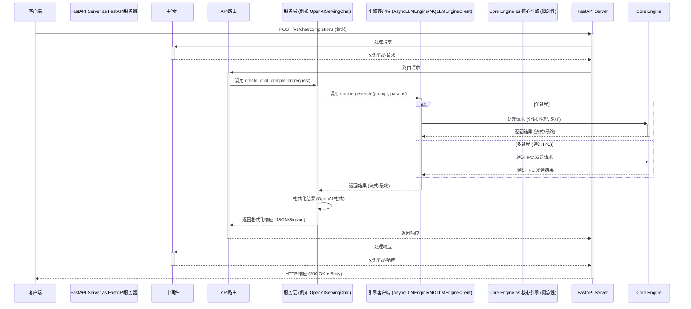

# vLLM OpenAI API 服务器请求处理流程分析

本文档基于 `vllm/entrypoints/openai/api_server.py` 源代码，分析了 vLLM OpenAI 兼容 API 服务器从接收请求到返回响应的完整流程。`wzh.evid` 目录为空，因此未包含特定的日志或错误信息。

## 核心组件

1.  **FastAPI 应用:** 作为基础，处理传入的 HTTP 请求、路由、中间件和响应生成。
2.  **API 路由 (`APIRouter`):** 定义具体的 API 端点，例如 `/v1/chat/completions`、`/v1/completions` 等。
3.  **服务类 (`OpenAIServing*`):** 例如 `OpenAIServingChat`、`OpenAIServingCompletion`、`OpenAIServingEmbedding` 等类，封装了处理特定 OpenAI API 格式的逻辑。它们负责将传入的请求转换为 vLLM 引擎可以理解的格式，并将引擎的输出格式化回 OpenAI 标准。
4.  **引擎客户端 (`EngineClient`):** 一个抽象层（单进程模式下为 `AsyncLLMEngine`，多进程模式下为 `MQLLMEngineClient`），用于与核心 vLLM 推理引擎通信。它发送处理请求（如生成文本或嵌入）并接收结果。
5.  **vLLM 核心引擎 (概念性):** 底层引擎（在此特定文件中未完全详述），负责管理 LLM 模型、KV 缓存、请求调度、分词、推理执行、采样和反分词等。

## 请求处理流程

1.  **HTTP 请求到达:** 客户端向服务器发送 HTTP 请求（例如，POST 到 `/v1/chat/completions`）。
2.  **中间件处理:** FastAPI 中间件（CORS、认证、日志记录、自定义中间件）处理请求。
    *   *认证示例:* 如果配置了 API 密钥，中间件会检查 `Authorization` 请求头。
        ```python
        # api_server.py 代码片段
        if token := args.api_key or envs.VLLM_API_KEY:

            @app.middleware("http")
            async def authentication(request: Request, call_next):
                # ... 检查 Authorization 请求头 ...
                if request.headers.get("Authorization") != "Bearer " + token:
                    return JSONResponse(content={"error": "Unauthorized"},
                                        status_code=401)
                return await call_next(request)
        ```
3.  **路由:** FastAPI 根据 URL 路径和 HTTP 方法将请求路由到相应的路径操作函数（例如，`/v1/chat/completions` 对应 `create_chat_completion` 函数）。
    ```python
    # api_server.py 代码片段
    @router.post("/v1/chat/completions",
                 dependencies=[Depends(validate_json_request)])
    @with_cancellation
    @load_aware_call
    async def create_chat_completion(request: ChatCompletionRequest,
                                     raw_request: Request):
        # ... 函数体 ...
    ```
4.  **依赖注入与处理器获取:** FastAPI 解析依赖项。处理函数通常依赖于从应用程序状态 (`request.app.state`) 中获取正确的 `OpenAIServing*` 实例。
    ```python
    # api_server.py 代码片段
    def chat(request: Request) -> Optional[OpenAIServingChat]:
        return request.app.state.openai_serving_chat

    # 在 create_chat_completion 内部:
    handler = chat(raw_request)
    if handler is None:
        return base(raw_request).create_error_response(
            message="The model does not support Chat Completions API")
    ```
5.  **服务层处理:** 调用获取到的处理器的相应方法（例如 `handler.create_chat_completion`），并传入请求对象。此方法执行：
    *   验证请求参数。
    *   将请求负载（例如，消息、提示）转换为适合 `EngineClient` 的参数。
    *   调用相应的 `EngineClient` 方法（例如 `generate`、`encode`）。
    ```python
    # api_server.py 代码片段 (在 create_chat_completion 内部)
    generator = await handler.create_chat_completion(request, raw_request)
    # 对引擎的实际调用发生在 handler.create_chat_completion 内部
    ```
6.  **引擎客户端交互:** `EngineClient` 从服务层接收请求。
    *   **单进程 (`AsyncLLMEngine`):** 在同一进程内直接与核心引擎组件交互。
    *   **多进程 (`MQLLMEngineClient`):** 通过 ZeroMQ IPC 将请求发送到独立的引擎进程 (`run_mp_engine`)。
        ```python
        # api_server.py 代码片段 (build_async_engine_client 逻辑)
        # 简化逻辑显示两种路径:
        if MQLLMEngineClient.is_unsupported_config(vllm_config) \
              or disable_frontend_multiprocessing:
            # 直接使用 AsyncLLMEngine
            engine_client = AsyncLLMEngine.from_vllm_config(...)
            yield engine_client
        else:
            # 使用 MQLLMEngineClient 进行多进程处理
            # ... 设置 IPC, 启动引擎进程 ...
            mq_engine_client = await asyncio.get_running_loop().run_in_executor(
                None, build_client)
            # ... 设置连接 ...
            yield mq_engine_client
        ```
7.  **核心引擎执行 (概念性):** 核心 vLLM 引擎接收请求（直接或通过 IPC）。它执行：
    *   请求排队和调度。
    *   分词（如果需要）。
    *   KV 缓存管理（检索/存储注意力缓存）。
    *   在 GPU/CPU 上进行模型推理。
    *   采样/Logits 处理以生成输出 token/embedding。
    *   反分词（如果生成文本）。
8.  **结果返回给引擎客户端:** 核心引擎将结果发送回 `EngineClient`（直接或通过 IPC）。这可能是 token 流或最终结果对象。
9.  **服务层格式化:** `OpenAIServing*` 处理器从 `EngineClient` 接收结果。它将这些结果格式化为标准的 OpenAI API 响应结构（例如 `ChatCompletionResponse`、`EmbeddingResponse`）。如果需要，它会处理流式逻辑。
10. **响应生成:** FastAPI 路径操作函数返回格式化后的响应。
    *   对于非流式请求，返回 `JSONResponse`。
    *   对于流式请求，返回 `StreamingResponse`。
    ```python
    # api_server.py 代码片段 (在 create_chat_completion 内部)
    if isinstance(generator, ErrorResponse):
        return JSONResponse(content=generator.model_dump(),
                            status_code=generator.code)
    elif isinstance(generator, ChatCompletionResponse): # 非流式情况
        return JSONResponse(content=generator.model_dump())
    # 流式情况
    return StreamingResponse(content=generator, media_type="text/event-stream")
    ```
11. **中间件处理 (响应):** 中间件可以处理传出的响应（例如，添加 `X-Request-Id` 等请求头）。
12. **HTTP 响应发送:** FastAPI 将最终的 HTTP 响应发送回客户端。

## Mermaid 时序图



该分析详细说明了从接收 API 请求到发送回响应的流程，基于所提供的源代码。
