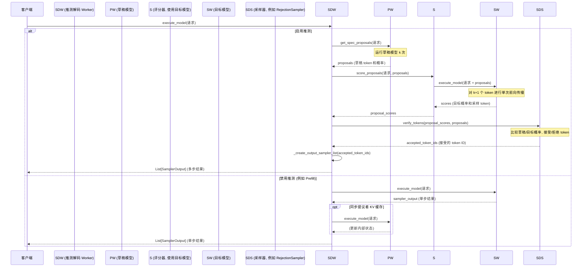

# vLLM 推测解码 (Speculative Decoding) 流程分析

## 核心思想

推测解码旨在通过使用一个更小、更快的“草稿”模型（或其它提议方法）来生成几个候选的未来 token（`k` 个 token），从而加速推理过程。然后，这些提议由更大、更准确的“目标”模型在单次前向传播中高效地验证。接着，一个采样机制决定这些提议的 token 中有多少可以被接受，这可能允许模型在每个目标模型执行步骤中生成多个 token，从而降低延迟。

## 关键组件

1.  **`SpeculativeProposer` (接口)**: 代表生成 token 提议的实体。
    *   实现: `MultiStepWorker` (用于类似 Llama 的草稿模型), `NGramWorker`, `MedusaWorker`, `MLPSpeculatorWorker`。位于 `vllm/spec_decode/`。
    *   方法: `get_spec_proposals` -> 返回 `SpeculativeProposals` (token id、来自提议者的概率、提议长度)。
    ```python
    # 来自 vllm/spec_decode/interfaces.py
    class SpeculativeProposer(ABC):

        @abstractmethod
        def get_spec_proposals(
            self,
            execute_model_req: ExecuteModelRequest,
            # ...
        ) -> SpeculativeProposals:
            raise NotImplementedError
    ```
2.  **`SpeculativeScorer` (接口)**: 代表使用目标模型对提议进行评分的实体。
    *   实现: `MQAScorer`, `BatchExpansionTop1Scorer`。位于 `vllm/spec_decode/`。
    *   方法: `score_proposals` -> 接收 `SpeculativeProposals`，运行目标模型，返回 `SpeculativeScores` (来自目标模型的概率和 logprobs、目标模型采样的 token id)。
    ```python
    # 来自 vllm/spec_decode/interfaces.py
    class SpeculativeScorer(ABC):
        # ...
        @abstractmethod
        def score_proposals(
            self,
            execute_model_req: ExecuteModelRequest,
            proposals: SpeculativeProposals,
        ) -> SpeculativeScores:
            raise NotImplementedError
    ```
3.  **`SpecDecodeBaseSampler` (基类)**: 执行接受/拒绝采样。
    *   实现: `RejectionSampler`, `TypicalAcceptanceSampler`。位于 `vllm/model_executor/layers/`。
    *   方法: `__call__` (或 `forward`) -> 接收目标概率、草稿概率、草稿 token、奖励 token，并确定接受的 token 序列。
    ```python
    # 来自 vllm/model_executor/layers/spec_decode_base_sampler.py (示意)
    class SpecDecodeBaseSampler(nn.Module, ABC):
        # ...
        @abstractmethod
        def forward(
            self,
            target_with_bonus_probs: torch.Tensor, # B x K+1 x V
            bonus_token_ids: torch.Tensor, # B x 1
            draft_probs: torch.Tensor, # B x K x V
            draft_token_ids: torch.Tensor, # B x K
            **kwargs: Any,
        ) -> torch.Tensor: # B x K+1
            raise NotImplementedError
    ```
4.  **`SpecDecodeWorker`**: 协调整个过程 (`vllm/spec_decode/spec_decode_worker.py`)。
    *   持有 `proposer_worker`、`scorer_worker` (包装目标模型运行器)、`scorer` (使用 `scorer_worker`) 和 `spec_decode_sampler` 的实例。
    *   管理提议者和评分者的 KV 缓存。
    *   在 `execute_model` 中处理主要的执行逻辑。

## 处理流程 (启用推测)

主要逻辑位于 `SpecDecodeWorker._run_speculative_decoding_step` 中：

1.  **获取提议 (Get Proposals)**:
    *   调用 `proposer_worker.get_spec_proposals` 方法。
    *   这通常涉及运行草稿模型前向传播 `k` 步以生成候选 token 序列。
    *   返回 `SpeculativeProposals` 对象。
    ```python
    # 来自 vllm/spec_decode/spec_decode_worker.py
    # (在 _run_speculative_decoding_step 内部)
    with Timer() as proposal_timer:
        # Generate proposals using draft worker.
        proposals = self.proposer_worker.get_spec_proposals(
            execute_model_req, self._seq_with_bonus_token_in_last_step)
    ```

2.  **评分提议 (Score Proposals)**:
    *   使用 `proposals` 调用 `scorer.score_proposals` 方法。
    *   评分者为目标模型准备输入，整合提议的 token。
    *   `scorer_worker` (目标模型) 执行 *单次* 前向传播，以评估所有提议 token 加上一个奖励 token 的概率。
    *   返回 `SpeculativeScores` 对象。
    ```python
    # 来自 vllm/spec_decode/spec_decode_worker.py
    # (在 _run_speculative_decoding_step 内部)
    with Timer() as scoring_timer:
        proposal_scores = self.scorer.score_proposals(
            execute_model_req,
            proposals,
        )
    ```

3.  **验证 Token (接受采样 - Acceptance Sampling)**:
    *   调用 `_verify_tokens` 方法，使用 `spec_decode_sampler`。
    *   采样器比较草稿模型和目标模型的概率。
    *   它根据采样算法（例如，拒绝采样）迭代决定是否接受每个提议的 token。
    *   输出最终接受的 token ID 序列。
    ```python
    # 来自 vllm/spec_decode/spec_decode_worker.py
    # (在 _verify_tokens 内部)
    accepted_token_ids = self.spec_decode_sampler(
        target_with_bonus_probs=proposal_verifier_probs,
        bonus_token_ids=bonus_token_ids,
        draft_probs=proposal_probs,
        draft_token_ids=proposal_token_ids,
        **sampler_extra_kwargs,
    )
    ```

4.  **格式化输出 (Format Output)**:
    *   `_create_output_sampler_list` 方法将 `accepted_token_ids` 格式化为 `SamplerOutput` 对象列表，可能跨越多个步骤。

## Mermaid 时序图



此流程使 vLLM 能够以大约一次目标模型前向传播加上草稿模型和验证逻辑的开销，潜在地生成多个 token，从而降低延迟。
