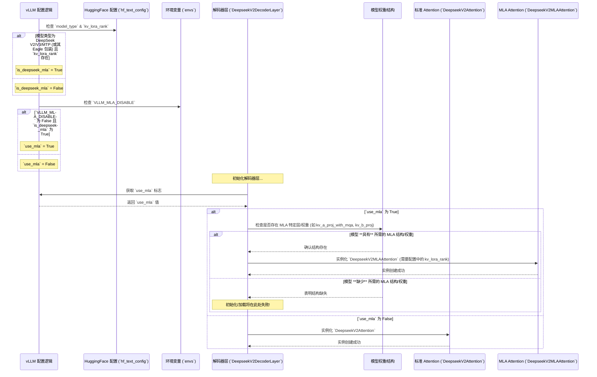

# vLLM 中 DeepSeek 模型多级注意力 (MLA) 的指定与使用机制

vLLM 对 DeepSeek V2/V3 模型的多级注意力（Multi-Level Attention, MLA）机制的支持，并非简单的配置开关，而是依赖于模型的**固有架构**和**运行时配置**共同决定的。以下是详细分析：

## 1. 配置层面的检查

vLLM 首先通过检查模型的 Hugging Face 配置 (`hf_text_config`) 和环境变量来判断是否*应该尝试*使用 MLA。

### a. `is_deepseek_mla` 属性 (`vllm/config.py`)

此属性判断模型配置是否表明其支持 MLA 架构：

-   **检查 `model_type`**: 确认模型类型是否为 `'deepseek_v2'`, `'deepseek_v3'`, 或 `'deepseek_mtp'` (或者是一个包装了这些模型的 `'eagle'` 模型)。
-   **检查 `kv_lora_rank`**: 如果模型类型匹配，则进一步检查配置中是否存在 `kv_lora_rank` 属性，并且其值**不为 `None`**。`kv_lora_rank` 的存在是 MLA 架构的关键标志。

*源代码片段 (`vllm/config.py`):*
```python
@property
def is_deepseek_mla(self) -> bool:
    if not hasattr(self.hf_text_config, "model_type"):
        return False
    elif self.hf_text_config.model_type in \
        ('deepseek_v2', 'deepseek_v3', 'deepseek_mtp'):
        # 检查 kv_lora_rank 是否存在且不为 None
        return getattr(self.hf_text_config, "kv_lora_rank", None) is not None
    elif self.hf_text_config.model_type == 'eagle':
        # 对 Eagle 模型检查其包装的基础模型和 kv_lora_rank
        return getattr(self.hf_text_config, "model", None) is not None and \
               getattr(self.hf_text_config.model, "model_type", None) in \
                ('deepseek_v2', 'deepseek_v3') \
            and getattr(self.hf_text_config, "kv_lora_rank", None) is not None
    return False
```

### b. `use_mla` 属性 (`vllm/config.py`)

此属性决定运行时是否**实际启用** MLA：

-   它结合了 `is_deepseek_mla` 的结果和 `VLLM_MLA_DISABLE` 环境变量。
-   只有当 `is_deepseek_mla` 为 `True` **并且** `VLLM_MLA_DISABLE` 环境变量未设置或为 `False` 时，`use_mla` 才为 `True`。

*源代码片段 (`vllm/config.py`):*
```python
@property
def use_mla(self) -> bool:
    return self.is_deepseek_mla and not envs.VLLM_MLA_DISABLE
```

## 2. 架构层面的硬编码依赖

仅仅通过配置检查是不够的。模型本身必须具备 MLA 的特定结构。vLLM 内部有针对 MLA 的硬编码实现。

### a. 不同的 Attention 类 (`vllm/model_executor/models/deepseek_v2.py`)

vLLM 为 DeepSeek V2 模型定义了两个不同的 Attention 实现：

-   `DeepseekV2Attention`: 用于**不包含** MLA 结构的标准模型。
-   `DeepseekV2MLAAttention`: **专门用于**包含 MLA 结构的模型。

### b. `DeepseekV2MLAAttention` 的结构要求

这个类在初始化时有特定的结构和参数要求，与标准 Attention 不同：

-   **强制 `kv_lora_rank`**: 初始化时必须传入 `kv_lora_rank` 参数。
-   **依赖特定层**: 需要模型权重中包含 MLA 特有的 K/V 投影层（如 `kv_a_proj_with_mqa`, `kv_b_proj`）及其对应的 LoRA 权重。
-   **调用 MLA 后端**: 初始化底层的 `Attention` 后端时，会传入 `use_mla=True`, `num_kv_heads=1` (MLA 特征), 以及根据 `kv_lora_rank` 计算的 `head_size`。

*源代码片段 (`DeepseekV2MLAAttention.__init__`):*
```python
class DeepseekV2MLAAttention(nn.Module):
    def __init__(
        self,
        # ... 其他参数 ...
        kv_lora_rank: int, # <--- MLA 必需的参数
        # ... 其他参数 ...
    ) -> None:
        super().__init__()
        # ... 定义 MLA 特定的投影层 ...

        self.mla_attn = Attention(
            # ...
            head_size=self.kv_lora_rank + self.qk_rope_head_dim, # 头大小包含 LoRA rank
            num_kv_heads=1, # MLA 固定为 1
            use_mla=True,   # 显式启用 MLA 后端逻辑
            kv_lora_rank=self.kv_lora_rank, # 传递 rank 给后端
            # ... 其他 MLA 特定参数 ...
        )
```

### c. 解码器层的条件实例化 (`vllm/model_executor/models/deepseek_v2.py`)

`DeepseekV2DecoderLayer` 在初始化时，会根据 `model_config.use_mla` 标志（该标志的值由第 1 步的配置检查决定）来选择实例化哪个 Attention 类。

*源代码片段 (`DeepseekV2DecoderLayer.__init__`):*
```python
class DeepseekV2DecoderLayer(nn.Module):
    def __init__(
        self,
        config: PretrainedConfig,
        prefix: str,
        model_config: ModelConfig, # 包含 use_mla 标志
        # ...
    ) -> None:
        # ...
        if model_config.use_mla: # 检查配置标志
            attn_cls = DeepseekV2MLAAttention # 选择 MLA 实现
        else:
            attn_cls = DeepseekV2Attention # 选择标准实现
        self.self_attn = attn_cls( # 实例化选择的类
            config=config,
            # ... 传递参数，如果 use_mla 为 True，则 kv_lora_rank 必须存在 ...
        )
        # ...
```

## 3. 总结

-   一个模型**不能**随意激活 MLA 功能，它必须在设计和训练时就**内置**了 MLA 所需的特定网络结构（尤其是 K/V 投影中的 LoRA 层）和相应的权重。
-   vLLM 通过检查模型的 Hugging Face **配置文件** (`model_type`, `kv_lora_rank`) 和**环境变量** (`VLLM_MLA_DISABLE`) 来判断是否应该为该模型启用 MLA 的**代码路径**。
-   如果配置表明应使用 MLA，`DeepseekV2DecoderLayer` 会尝试实例化**硬编码**的 `DeepseekV2MLAAttention` 类。
-   如果模型实际上**缺少** MLA 结构但配置标志被（错误地）设置了，那么在模型加载或运行时会**失败**。

## 4. Mermaid 时序图

