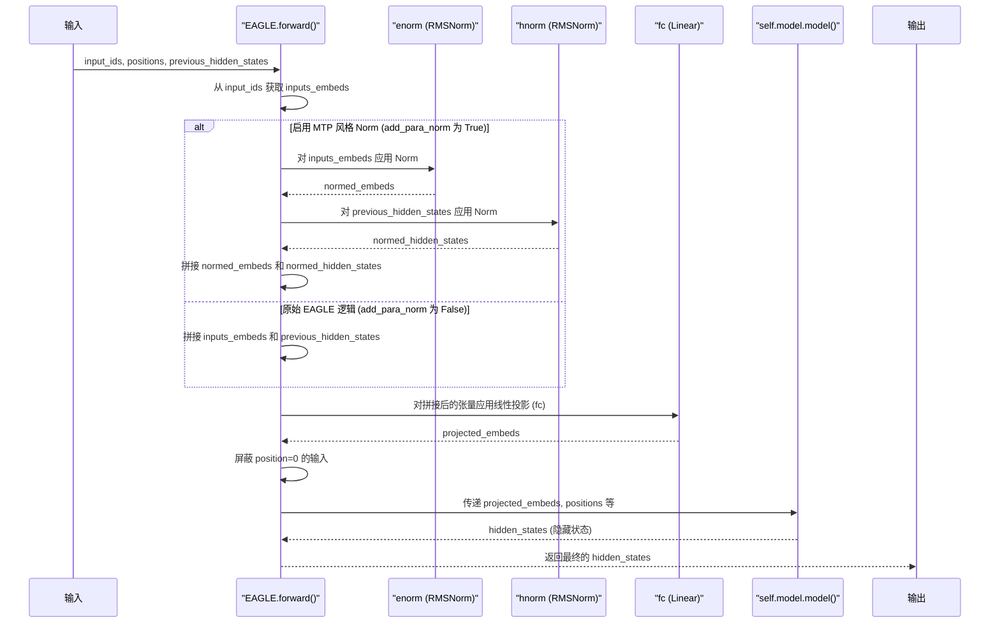

# EAGLE 模型与 MTP 关系分析 (基于 vLLM 代码)

本文档基于对 `vllm/model_executor/models/eagle.py` 文件的分析，总结了 EAGLE 模型及其与 MTP (DeepSeek Mixture-of-Thought Pathways) 的关系。

## 1. EAGLE 是什么？

根据代码分析，EAGLE 是 **推测解码 (speculative decoding)** 中使用的一种特定的 **“草稿模型” (draft model)** 架构。推测解码是一种加速大型语言模型推理的技术，它使用一个更小、更快的“草稿”模型来预测词元序列，然后由更大、更原始的模型来验证这些预测。

*   **源代码证据 (类文档字符串):**
    ```python
    class EAGLE(nn.Module):
        """This class implements the EAGLE draft model from the paper: https://arxiv.org/pdf/2401.15077
        Reference implementation: https://github.com/SafeAILab/EAGLE
        
        Differences from reference implementation:
        # ... (为简洁省略细节) ...
        """
    ```
    这个文档字符串明确指出该类实现了 EAGLE 草稿模型。

## 2. EAGLE 与 MTP 的关系

vLLM 实现的 EAGLE 模型允许一种 **增强型架构**，该架构借鉴或受到了 **DeepSeek MTP** 模块的设计元素的启发，特别是在 **归一化层 (normalization layers)** 的使用方面。原始的 EAGLE 架构具有某些特性（例如跳过某些归一化步骤），vLLM 的实现根据 MTP 的发现对这些特性进行了修改，旨在提高性能。

*   **源代码证据 (类文档字符串):**
    ```python
        # ... (省略前面的点) ...
        4. We allow an enhanced EAGLE architecture similar to the DeepSeek MTP 
           module with regards to the use of additional RMS norms. The original 
           EAGLE architecture 1) skips the pre-attention norm in its first 
           transformer block, and 2) skips the final output norm, both of which we 
           found to be suboptimal. We also add the support for separate norms
           applying to both the token embedding and hidden states before projection
           as in DeepSeek MTP, which we found to improve performance as well.
    ```
    这段注释清晰地概述了两者关系：vLLM 的 EAGLE 实现可以选择性地采用受 DeepSeek MTP 启发的归一化策略 (`RMSNorm`) 来增强原始 EAGLE 设计。

*   **源代码证据 (具体实现):**
    代码通过 `add_para_norm` 标志和专门的归一化层 (`enorm`, `hnorm`) 来实现这种可选的增强。

    *   初始化:
        ```python
            self.add_para_norm = False
            if hasattr(self.config.model,
                       "add_para_norm") and self.config.model.add_para_norm:
                # 如果配置中启用了 add_para_norm
                self.enorm = RMSNorm(config.hidden_size, eps=config.rms_norm_eps) # 词嵌入的 Norm
                self.hnorm = RMSNorm(config.hidden_size, eps=config.rms_norm_eps) # 隐藏状态的 Norm
                self.add_para_norm = True
        ```
        这部分代码检查配置标志 `add_para_norm`，并在该标志为真时初始化单独的 RMSNorm 层，模仿 MTP 风格的方法。

    *   在 `forward` 方法中的使用:
        ```python
        def forward(
            # ... 参数 ...
        ) -> torch.Tensor:
            # ...
            if self.add_para_norm: # 检查是否启用了 MTP 风格的 Norm
                inputs_embeds = torch.cat([
                    self.enorm(inputs_embeds),          # 对词嵌入应用 Norm
                    self.hnorm(previous_hidden_states) # 对隐藏状态应用 Norm
                ],
                                          dim=-1)
            else:
                # 原始 EAGLE 风格的拼接 (没有单独的 Norm)
                inputs_embeds = torch.cat([inputs_embeds, previous_hidden_states],
                                          dim=-1)
            # ... (forward 方法的其余部分) ...
        ```
        这里显式检查 `self.add_para_norm`。如果为真，则在拼接和投影之前应用单独的 `enorm` 和 `hnorm` 层，遵循受 MTP 启发的增强。否则，使用标准的拼接方式。

## 3. Mermaid 时序图 (说明受 MTP 启发的 Norm 逻辑)

该图展示了 `forward` 方法内部的流程，重点突出了受 MTP 启发的归一化逻辑的条件性应用。



## 总结

`vllm/model_executor/models/eagle.py` 文件实现了用于推测解码的 EAGLE 草稿模型架构。值得注意的是，vLLM 的实现提供了一个可选的增强功能，该功能借鉴了 DeepSeek MTP 模块中的归一化技术（特别是使用额外的 RMSNorm 层），旨在克服原始 EAGLE 设计中的一些次优方面，从而可能提高性能。
