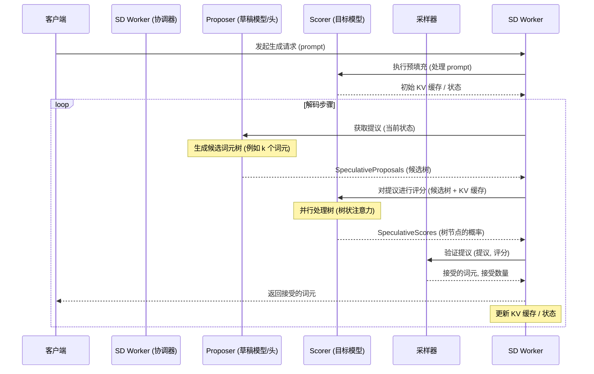

# vLLM 中的“树状注意力”与推测解码（Speculative Decoding）分析

## 1. “树状注意力”（Tree Attention）概念

“树状注意力”并非像“多头注意力”（Multi-Head Attention）那样是一个严格定义的术语。然而，在推测解码（Speculative Decoding）及其变种（如 Eagle、Medusa）的语境下，它描述了这样一个过程：**主模型（Target Model）的注意力机制并行处理一个由候选未来词元（Candidate Tokens）组成的“树”或“批次”**。

这个过程发生在推测解码的验证（Verification）步骤中。

## 2. vLLM 中的应用

通过代码搜索和分析，可以确认 **vLLM 广泛应用了推测解码技术** 来加速大型语言模型的推理过程。

*   **核心机制：** 推测解码的核心思想是使用一个更快的“草稿模型”（Draft Model）或附加在主模型上的特殊“头”（如 Medusa 的多头、Eagle 的草稿头）来预测多个可能的未来词元序列（形成候选树）。
*   **并行验证：** 然后，更大、更精确的主模型（Target Model）接收这个候选词元树，并在**一次前向传播中并行处理所有这些候选词元**。主模型内部的注意力层需要计算所有这些候选词元的注意力分数，这实际上就是对整个提议的“树”进行注意力计算——即“树状注意力”发挥作用的地方。
*   **接受与拒绝：** 主模型的输出决定了候选树中哪条路径是它自己也会生成的。最长的匹配路径被接受，然后从最后一个被接受的词元开始重复这个过程。

## 3. vLLM 代码证据

vLLM 代码库中包含大量实现推测解码的证据：

*   **核心框架：**
    *   `vllm/spec_decode/`: 该目录下包含了推测解码的核心组件，如 `spec_decode_worker.py`（协调器）、`multi_step_worker.py`、`interfaces.py`（定义了 `SpeculativeProposals` 和 `SpeculativeScores` 等接口）。
    *   各种采样器实现：如 `vllm/model_executor/layers/rejection_sampler.py` 和 `vllm/model_executor/layers/typical_acceptance_sampler.py` 用于验证步骤。
*   **具体方法实现：**
    *   **Eagle:** 在 `vllm/model_executor/models/eagle.py` 和 `vllm/model_executor/models/llama_eagle.py` 中有明确实现。Eagle 使用其草稿头内的注意力机制生成候选树。相关测试位于 `tests/spec_decode/e2e/test_eagle_correctness.py`。
    *   **Medusa:** 在 `vllm/model_executor/models/medusa.py` 和 `vllm/spec_decode/medusa_worker.py` 中实现。Medusa 使用附加到目标模型的多个解码头来生成候选词元。相关测试位于 `tests/spec_decode/e2e/test_medusa_correctness.py`。
    *   其他方法：代码中还包含了 Ngram、基于 MLP 的推测器（`mlp_speculator`）和 MTP（如 DeepSeekMTP）等方法的支持。
*   **配置与支持：**
    *   `--speculative-config` 参数 (`vllm/engine/arg_utils.py`) 允许用户启用和配置推测解码。
    *   `num_lookahead_slots` 参数 (`vllm/config.py`, `vllm/sequence.py`) 用于在 KV 缓存中预分配空间，以存储候选词元的键值（Key/Value），支持目标模型的并行验证。

## 4. 工作机制简述

推测解码在 vLLM 中的大致流程如下：

1.  **提议（Propose）：** Proposer Worker（如 MedusaWorker 或 Eagle 逻辑）根据当前状态生成一个候选词元树。
2.  **评分（Score）：** Scorer Worker（主模型）并行处理这个候选树（应用“树状注意力”），计算每个候选词元的概率。
3.  **验证（Verify）：** Sampler（如 RejectionSampler）根据提议和评分结果，确定哪些词元被接受。
4.  **输出与更新：** 将接受的词元添加到输出序列，并更新模型状态（如 KV 缓存）。

## 5. Mermaid 时序图

## 6. 结论

虽然“树状注意力”不是 vLLM 代码库中直接使用的术语，但推测解码（如 Eagle、Medusa）的核心验证步骤依赖于目标模型的注意力机制并行处理候选词元树。这个过程是 vLLM 实现推理加速的关键部分之一，并且在概念上对应了“树状注意力”所描述的机制。
