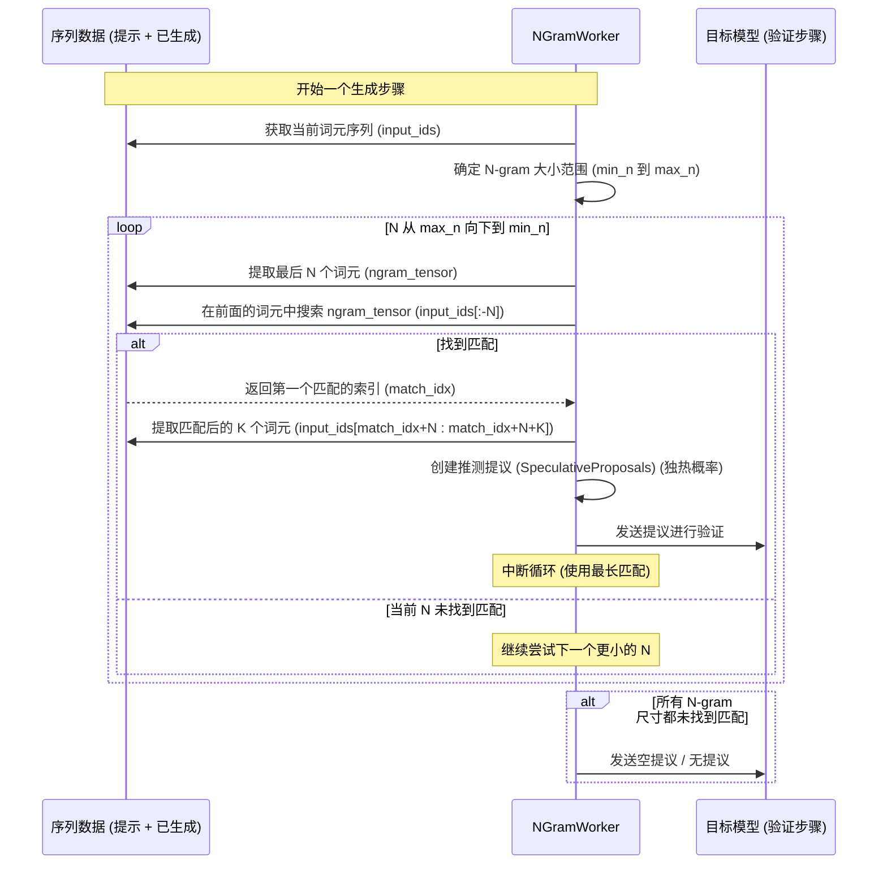

# vLLM Ngram 推测解码 (Ngram SD) 分析

## 概述

根据对 `vllm/spec_decode/ngram_worker.py` 源代码的分析，"Ngram SD" 指的是 vLLM 中实现的一种**推测解码 (Speculative Decoding, SD)** 策略。该策略利用在提示 (prompt) 和先前已生成词元 (token) 中找到的 **N-gram** 来提议候选的未来词元。

## 关键特性

1.  **无模型草稿 (Model-Free Drafting):** 它在运行时*不需要*一个独立的草稿语言模型 (`NonLLMProposerWorkerBase`)，因此计算开销很小。

    ```python
    # 来源: vllm/spec_decode/ngram_worker.py
    class NGramWorker(NonLLMProposerWorkerBase):
        """NGramWorker 提供了一个轻量级的草稿器，无需模型。"""
        # ...
        def get_model(self) -> nn.Module:
            return _DummyModel() # 返回一个虚拟模型
    ```

2.  **提示/历史查找 (Prompt/History Lookup):** 它搜索现有的词元序列（提示 + 已生成部分）以查找最近 N-gram 的出现位置。

    ```python
    # 来源: vllm/spec_decode/ngram_worker.py - sampler_output 方法逻辑
    # ...
    input_ids = torch.as_tensor(seq_data.get_token_ids(), ...) # 当前序列
    # ... 遍历 ngram_size ...
    ngram_tensor = input_ids[-ngram_size:] # 最后 N 个词元
    # ... 使用 windows = input_ids.unfold(...) 进行搜索逻辑 ...
    matches = (windows[:-1] == ngram_tensor).all(dim=-1) # 查找匹配项
    first_match = matches.max(dim=-1) # 获取第一个匹配项
    if first_match.values.item():
        proposal_start_idx = first_match.indices.add_(ngram_size) # 匹配项之后的索引
        # ... 收集提议的词元 ...
        res = input_ids.gather(dim=-1, index=spec_indices) # 提议匹配项之后的词元
    # ...
    ```

3.  **最长匹配优先 (Longest Match Priority):** 它首先尝试查找（在配置的 `ngram_prompt_lookup_min` 到 `ngram_prompt_lookup_max` 范围内）可能的最长 N-gram 匹配。

4.  **提议生成 (Proposal Generation):** 如果找到匹配项，序列历史中紧随该匹配项之后的词元将被提议为推测候选词元。其概率实际上是独热编码 (one-hot encoded) 的。

## 工作流程时序图



## 总结

Ngram SD 是 vLLM 实现的一种推测解码技术，它利用序列中的重复模式而不是草稿模型来提议词元。
