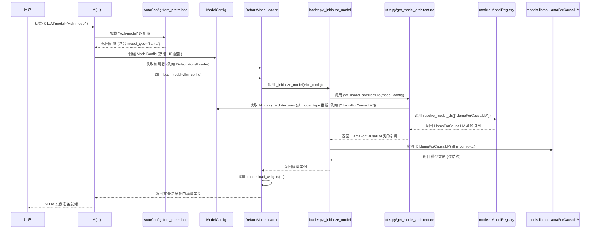

# vLLM 如何确定模型架构

vLLM 通过与模型标识符（例如 "wzh-model"）关联的 `config.json` 文件来确定要使用哪个具体的模型实现代码（例如 Llama 的代码）。以下是详细的分析过程：

## 核心机制

1.  **`config.json` 是关键:** 当你微调一个基础模型（如 Llama）并将其保存为新的标识符（"wzh-model"）时，其对应的 `config.json` 文件会包含（或应更新包含）一个关键字段 `"model_type"`。对于 Llama 微调的模型，该字段的值应为 `"llama"`。这个字段明确声明了模型的基础架构。

2.  **加载配置:** vLLM 在初始化时（例如执行 `LLM(model="wzh-model")`），会利用 Hugging Face 的工具（如 `transformers.AutoConfig.from_pretrained`）来加载这个 `config.json` 文件。`model_type` 的值会被存储在 vLLM 内部的 `ModelConfig` 对象中。

3.  **架构映射:** vLLM 使用从 `config.json` 中读取到的 `model_type` 值（"llama"）来推断出标准的架构名称（例如 "LlamaForCausalLM"）。这个架构名称通常在 `config.json` 的 `architectures` 字段中也能找到。

4.  **内部注册表查询:** vLLM 维护一个内部的注册表（`ModelRegistry`），该注册表将这些架构名称（如 "LlamaForCausalLM"）映射到 vLLM 内部负责处理这些架构的、经过优化的特定 Python 类（例如 `vllm.model_executor.models.llama.LlamaForCausalLM`）。

5.  **实例化:** vLLM 根据注册表查询到的结果，实例化正确的 Python 类（例如 `LlamaForCausalLM`）来构建模型的骨架结构。随后，"wzh-model" 的实际权重会被加载到这个结构中。

## 代码逻辑追溯

*   这个过程通常始于相关加载器（通常是 `DefaultModelLoader`，位于 `vllm/model_executor/model_loader/loader.py`）的 `load_model` 方法。
*   `load_model` 调用 `_initialize_model`（也在 `loader.py` 中）。
*   `_initialize_model` 继而调用 `get_model_architecture`（位于 `vllm/model_executor/model_loader/utils.py`）。
*   `get_model_architecture` 函数负责读取从 `config.json` 的 `model_type` 推断出的架构信息，并使用 `ModelRegistry.resolve_model_cls` 来查找对应的 vLLM 类。

## 时序图 (Sequence Diagram)

